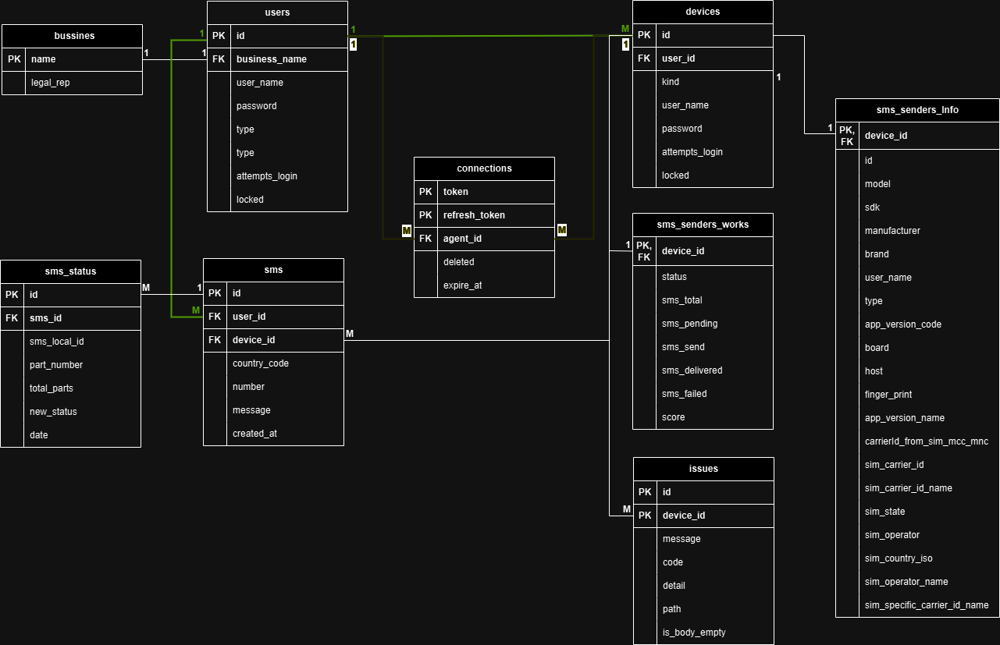

# APISMS v1.0.0

This API is made to expose the funtionality to a device can get info to send SMS and to an user can set the info necessary to send SMS.

## End points:

### Auth

| path         | verb | payload                                                     | payload type | response                                                                                                                                                                              |
| ------------ | ---- | ----------------------------------------------------------- | ------------ | ------------------------------------------------------------------------------------------------------------------------------------------------------------------------------------- |
| /auth/login  | POST | {"agentId": string, "userName": string, "password": string} | body         | {"token": string, "tokenLifeTime": number, "tokenExpireAt": number, "refreshToken": string, "refreshTokenExtraLifeTime": number, "refreshTokenExpireAt": number, "createdAt": number} |
| /auth/login  | POST | Authorization: Bearer YOUR_REFRESH_TOKEN                    | header       | {"token": string, "tokenLifeTime": number, "tokenExpireAt": number, "refreshToken": string, "refreshTokenExtraLifeTime": number, "refreshTokenExpireAt": number, "createdAt": number} |
| /auth/logout | POST | Authorization: Bearer YOUR_TOKEN                            | header       | N/A                                                                                                                                                                                   |
| /auth/valid  | POST | Authorization: Bearer YOUR_TOKEN                            | header       | N/A                                                                                                                                                                                   |

### User

By default;
| payload                          | payload type |
| -------------------------------- | ------------ |
| Authorization: Bearer YOUR_TOKEN | header       |

| path                        | verb | payload                                                      | payload type | response       |
| --------------------------- | ---- | ------------------------------------------------------------ | ------------ | -------------- |
| /apis/v1/user/sms/send      | PUT  | {"countryCode": string, "number": string, "message": string} | body         | {"id": string} |
| /apis/v1/user/admon/devices | PUT  | {"userName": string, "password": string}                     | body         | \ |

### Device

By default;
| payload                          | payload type |
| -------------------------------- | ------------ |
| Authorization: Bearer YOUR_TOKEN | header       |

| path                                 | verb | payload                                                                                                                                                                                                                                                                                                                                                                                                                                                                                                                                                  | payload type | response                                                                            |
| ------------------------------------ | ---- | -------------------------------------------------------------------------------------------------------------------------------------------------------------------------------------------------------------------------------------------------------------------------------------------------------------------------------------------------------------------------------------------------------------------------------------------------------------------------------------------------------------------------------------------------------- | ------------ | ----------------------------------------------------------------------------------- |
| /apis/v1/device/senders/sms/register | PUT  | {"appVersionCode": string, "appVersionName": string, "board": string, "brand": string, "carrierIdFromSimMccMnc": number (opcional), "fingerPrint": string, "host": string, "id": string, "manufacturer": string, "model": string, "sdk": number, "simCarrierId": number (opcional), "simCarrierIdName": string (opcional), "simCountryIso": string (opcional), "simOperator": string (opcional), "simOperatorName": string (opcional), "simSpecificCarrierIdName": string (opcional), "simState": number (opcional), "type": string, "userName": string} | body         | N/A                                                                                 |
| /apis/v1/device/senders/sms/online   | POST | N/A                                                                                                                                                                                                                                                                                                                                                                                                                                                                                                                                                      | N/A          | N/A                                                                                 |
| /apis/v1/device/senders/sms/offline  | POST | N/A                                                                                                                                                                                                                                                                                                                                                                                                                                                                                                                                                      | N/A          | N/A                                                                                 |
| /apis/v1/device/senders/sms/issue    | POST | { "code": number, "message": string (optional), "detail": string (optional), "path": string (optional), "isBodyEmpty": boolean (optional) }                                                                                                                                                                                                                                                                                                                                                                                                              | body         | {"id": string}                                                                      |
| /apis/v1/device/senders/sms/update   | POST | {"smsId": string, "smsLocalId": string, "partNumber": number, "totalParts": number, "status": string}                                                                                                                                                                                                                                                                                                                                                                                                                                                    | body         | N/A                                                                                 |
| /apis/v1/device/senders/sms/pending  | POST | {"smsIds": List\<string>}                                                                                                                                                                                                                                                                                                                                                                                                                                                                                                                                | body         | List<{"smsId": string, "countryCode": string, "number": string, "message": string}> |

### Disctionary

Auth:

- /auth/login

| response code | response json        | detail                                          |
| ------------- | -------------------- | ----------------------------------------------- |
| 400           | { "detail": string } | Missing and/or invalid token                    |
| 401           | { "detail": string } | Invalid token                                   |
| 401           | { "detail": string } | Your last connection already is valid           |
| 401           | { "detail": string } | Invalid agentId and/or userName and/or password |
| 401           | { "detail": string } | User locked by exced attempt login limit        |
| 500           | { "detail": string } | N/A                                             |

- /auth/valid

| response code | response json        | detail                                |
| ------------- | -------------------- | ------------------------------------- |
| 400           | { "detail": string } | Missing and/or invalid token          |
| 401           | { "detail": string } | Invalid token                         |
| 401           | { "detail": string } | Your last connection already is valid |

- /auth/logout

| response code | response json        | detail                       |
| ------------- | -------------------- | ---------------------------- |
| 400           | { "detail": string } | Missing and/or invalid token |
| 401           | { "detail": string } | Invalid token                |
| 404           | { "detail": string } | Invalid token                |
| 500           | { "detail": string } | N/A                          |

User:

- /apis/v1/user/sms/send

| response code | response json        | detail                                                      |
| ------------- | -------------------- | ----------------------------------------------------------- |
| 400           | { "detail": string } | Missing and/or invalid token                                |
| 400           | { "detail": string } | Missing or invalid countryCode and/or number and/or message |
| 401           | { "detail": string } | Invalid token                                               |
| 403           | { "detail": string } | Invalid token                                               |
| 404           | { "detail": string } | No SMS senders found                                        |
| 500           | { "detail": string } | N/A                                                         |

- /apis/v1/user/admon/devices

| response code | response json        | detail                                      |
| ------------- | -------------------- | ------------------------------------------- |
| 400           | { "detail": string } | Missing and/or invalid token                |
| 400           | { "detail": string } | Missing or invalid userName and/or password |
| 400           | { "detail": string } | Device already registed                     |
| 401           | { "detail": string } | Invalid token                               |
| 403           | { "detail": string } | Invalid token                               |
| 500           | { "detail": string } | N/A                                         |

Device:

- /apis/v1/device/senders/sms/register

| response code | response json        | detail                                                                                                                                                                                      |
| ------------- | -------------------- | ------------------------------------------------------------------------------------------------------------------------------------------------------------------------------------------- |
| 400           | { "detail": string } | Missing and/or invalid token                                                                                                                                                                |
| 400           | { "detail": string } | Missing and/or invalid model, id, sdk, manufacturer, brand, userName, type, appVersionCode, board, host, fingerPrint, appVersionName, simState, simOperator, simCountryIso, simOperatorName |
| 401           | { "detail": string } | Invalid token                                                                                                                                                                               |
| 403           | { "detail": string } | Invalid token                                                                                                                                                                               |
| 500           | { "detail": string } | N/A                                                                                                                                                                                         |

- /apis/v1/device/senders/sms/online

| response code | response json        | detail                       |
| ------------- | -------------------- | ---------------------------- |
| 400           | { "detail": string } | Missing and/or invalid token |
| 401           | { "detail": string } | Invalid token                |
| 403           | { "detail": string } | Invalid token                |
| 404           | { "detail": string } | Invalid device               |
| 500           | { "detail": string } | N/A                          |

- /apis/v1/device/senders/sms/offline

| response code | response json        | detail                       |
| ------------- | -------------------- | ---------------------------- |
| 400           | { "detail": string } | Missing and/or invalid token |
| 400           | { "detail": string } | Invalid device               |
| 401           | { "detail": string } | Invalid token                |
| 403           | { "detail": string } | Invalid token                |
| 500           | { "detail": string } | N/A                          |

- /apis/v1/device/senders/sms/issue

| response code | response json        | detail                       |
| ------------- | -------------------- | ---------------------------- |
| 400           | { "detail": string } | Missing and/or invalid token |
| 400           | { "detail": string } | Missing and/or invalid code  |
| 401           | { "detail": string } | Invalid token                |
| 403           | { "detail": string } | Invalid token                |
| 500           | { "detail": string } | N/A                          |

- /apis/v1/device/senders/sms/update

| response code | response json        | detail                                                                          |
| ------------- | -------------------- | ------------------------------------------------------------------------------- |
| 400           | { "detail": string } | Missing and/or invalid token                                                    |
| 400           | { "detail": string } | Missing or invalid argument/s smsId, smsLocalId, partNumber, totalParts, status |
| 401           | { "detail": string } | Invalid token                                                                   |
| 403           | { "detail": string } | Invalid token                                                                   |
| 500           | { "detail": string } | N/A                                                                             |

- /apis/v1/device/senders/sms/pending

| response code | response json        | detail                             |
| ------------- | -------------------- | ---------------------------------- |
| 400           | { "detail": string } | Missing and/or invalid token       |
| 400           | { "detail": string } | Missing o invalid apiSMSIdsPending |
| 401           | { "detail": string } | Invalid token                      |
| 403           | { "detail": string } | Invalid token                      |
| 500           | { "detail": string } | N/A                                |

For more information check Postman colletion [here](https://github.com/AguilasBuildingCode/APISMS/tree/main/docs/postman).

## DB:

